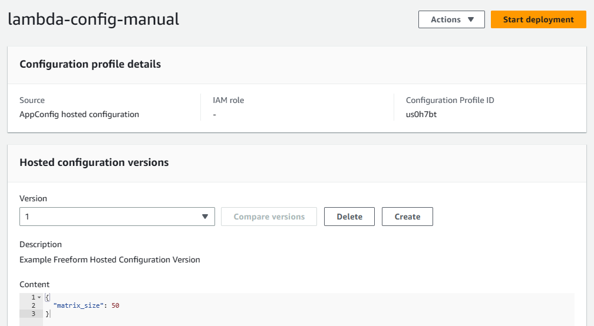
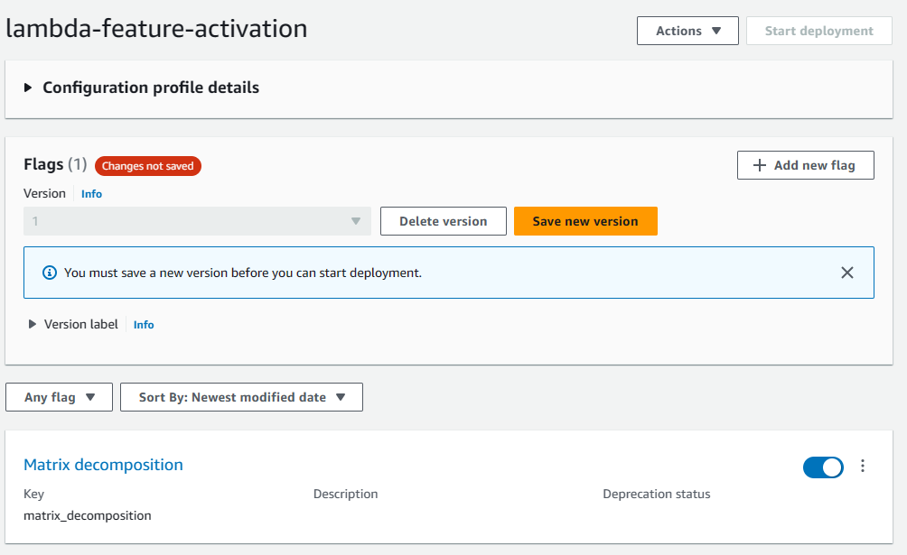

# Demo of Serverless Application Configration with AWS AppConfig 
This repository contains a demo showing how to use AWS AppConfig to manage the configuration of a serverless application
using AWS Lambda Functions outside the application infrastructure code (here Terraform).

Whether you use Terraform or the AWS CDK, the 
* AWS Lambda Function configuration (e.g. memory size, ARM vs X86 architecture)
* Related resources (e.g. IAM Role, CloudWatch Logs)
* The code
* The application configuration (e.g. an application threshold value) passed as environment variables

are often mixed together in the same repository. In such cases changing an application configuration parameter 
passed to the code as an AWS Lambda Function environment variable requires the redeployment of the application 
infrastructure stack.

Wouldn’t it be nice to decouple the function application configuration from the infrastructure configuration and code? 

This is where AWS AppConfig (a component of AWS Systems Manager) can help.
## Demo Architecture Diagram

### Deploying the Demo
Please refer to this demo's [Terraform Documentation](./TERRAFORM.md) for more details about this Terraform code and
options.

1. Clone this repo and navigate into the repository folder.
2. From your CLI, initialize and deploy this demo infrastructure using Terraform
    ```bash
    terraform init
    terraform apply -var-file=env.tfvars
    ```

You can update the `env.tfvars` file to change or add the environments you want to deploy and test.
The configuration of the environments is done using the variable `envs_config` in the `env.tfvars` file as follows:
```hcl
envs_config = {
  environment_key = {
    env             = "Environment name e.g. 'Prod'"
    deployment_type = "Type of deployment e.g. 'manual' or 'pipeline'"
    architecture    = "Type of AWS Lambda Function architecture e.g. 'x86_64' or 'arm64'"
  }
}    
```
This demonstrates how infrastructure configuration is separated from the application configuration handled through AWS 
AppConfig.
### Destroying the Demo
To be able to destroy AWS AppConfig Configuration profiles and feature flags, the deployments of those configurations 
and features must be deleted in order to be able to delete the configuration profiles and feature flags themselves. But
performing the demo, you will create versions of these configurations and features which Terraform does not know about 
and will not delete by itself. Also, Terraform does not provide an option to force the cleanup of versions when deleting 
these resources. So you have to manually delete the versions of the configurations and feature flages before destroying 
the demo, otherwise the Terraform destroy will fail.
## Running the Demo
### Test Environment Configuration Change
1. Navigate to the AWS Lambda service and the `********-demo-lambda-test-manual` function
2. Click on the `Test` button, leave the `Event` empty or as default, click on the `Save` button and then again on the
`Test` button
3. You will see in the logs the value of the `matrix_size` parameter and the feature flag
```text
"message":"Application configuration: {'matrix_size': 50}"
"message":"Feature activation: {'enabled': False}"
```
4. Navigate to the AWS AppConfig service (within AWS Systems Manager) and the `lambda-demo` application
5. Open the `lambda-config-manual` configuration profile. You will see the current configuration version displayed with 
the current value of the `matrix_size` parameter 

6. Click on the `Create` button and change the `matrix_size` parameter value to a different value (e.g. 70) and click 
on the `Create hosted configuration version` button
7. Make sure your new version with the new value is selected and click on the `Start deployment` button 
8. Select the `Test` environment and the `Demo.AllAtOnce` deployment strategy and click on the `Start deployment` button
9. Navigate back to the AWS Lambda service and the `********-demo-lambda-test-manual` function and retest the function. 
You might not see the changes immediately due to the 30 seconds caching of the AWS AppConfig extension. In that case 
wait for 30 seconds (for the cache to clear) and retest the function; you should see the new value of the `matrix_size` 
parameter
### Prod Environment Configuration Change
1. Navigate to the AWS Lambda service and the `********-demo-lambda-prod-pipeline` function
2. Click on the `Test` button, leave the Event empty or as default, click on the `Save` button and then again on the
`Test` button
3. You will see in the logs the value of the `matrix_size` parameter and the feature flag
```text
"message":"Application configuration: {'matrix_size': 100}"
"message":"Feature activation: {'enabled': False}"
```
4. In the `assets/config/` folder of this repository, edit the `prod.json` file and change the value of the `matrix_size`. 
5. Package the `assets/config/` folder in a zip archive named `lambda-config.zip` and upload it to the 
`********-codepipeline-appconfig-lambda-test` S3 bucket
6. Navigate to the AWS CodePipeline service and the `********-lambda-config-deployment` pipeline. You should see the
pipeline starting to deploy the new configuration in the `Prod` environment
7. Navigate back to the AWS Lambda service and the `********-demo-lambda-prod-pipeline` function. Depending on whether 
the cache has expired or not and whether AWS Appconfig will decide to use the old or new value, you might still see the
old value if you execute the function. Wait for the deployment to complete and retest the function; you should see the 
new `matrix_size` parameter value.
### Activating the Feature Flag
In this demo the feature flag controls whether additional matrix decomposition operations are performed or not by the 
AWS Lambda Functions. The feature flag is set to `False` by default. In the CloudWatch logs and metrics you will see 
only 2 operations performed: matrix and vector multiplications (the number of computations will vary as they are random).
```text
"message":"Dotted two 70x70 matrices."
"message":"Dotted two vectors of length 8960."
"message": {
     "nb_computations": {
         "nb_mx_dot_computation": 166,
         "nb_vect_dot_computation": 103,
     }
}
```
To activate the feature flag:
1. Navigate back to the AWS AppConfig service (within AWS Systems Manager) and the `lambda-demo` application
2. Open the `lambda-feature-activation` feature flag
3. Click on the `Matrix decomposition` activation button, then on the `Save new version` button

   
4. Make sure your new version is selected and click on the `Start deployment` button
5. Select the `Test` environment and the `Demo.AllAtOnce` deployment strategy and click on the `Start deployment` button
6. Navigate back to the AWS Lambda service and the `********-demo-lambda-test-manual` function and retest the function.
You might not see the changes immediately due to the 30 seconds caching of the AWS AppConfig extension. In that case
wait for 30 seconds for the cache to refresh and retest the function. You should see the feature flag activated in the 
CloudWatch logs:
```text
"message":"Application configuration: {'matrix_size': 70}"
"message":"Feature activation: {'enabled': True}"
``` 
You should also see 3 additional matrix decomposition operations performed in the CloudWatch logs and metrics (the 
number of computations will vary as they are random).
```text
"message":"Dotted two 70x70 matrices."
"message":"Dotted two vectors of length 8960."
"message":"SVD of a 70x70 matrices."
"message":"Cholesky decomposition of a 70x70 matrice."
"message":"Eigendecomposition of a 70x70 matrice.
"message": {
     "nb_computations": {
         "nb_mx_dot_computation": 143,
         "nb_vect_dot_computation": 143,
         "nb_mx_svd_computation": 185,
         "nb_mx_cholesky_computation": 186,
         "nb_mx_eig_computation": 156
     }
}
```
### Linear Deployments and Cache Refresh
An extra AWS Lambda Function is provided which will perform 20 parallel (almost) synchronous invocation of the Prod 
environment application to test the linear deployment. If you change again the matrix_size parameter in the prod 
configuration file and perform these steps
1. trigger the `********-trigger-lambda` function to cache configuration
2. then push a new version of the configuration file following the instructions above
3. re-trigger the `********-trigger-lambda` function within 30 seconds after the deployment started
4. re-trigger the `********-trigger-lambda` function after 30 seconds but before the end of the deployment (within 60 
seconds) 
5. re-trigger the `********-trigger-lambda` function some time after the deployment is finished

you will see in CloudWatch Logs of the `********-trigger-lambda` function, the matrix_size parameter changing for the 20 
AWS Lambda Function executions. You might notice however, that during the deployment you will not get immediately and 
not exactly 10 AWS Lambda Functions with the old value and 10 with the new value. 

Why?


If there was no caching (top timeline in the drawing), the AWS Lambda Function would always query the AWS AppConfig 
service for configuration. With this demo configuration, during the deployment the AWS AppConfig service answers half of 
the time with the old value and half of the time with the new value. And because in such a scenario the Lambda Function 
would not cache values, the application would use half of the time the old configuration and half of the time the new 
configuration.

But the AWS Lambda Function AppConfig extension is caching (30 seconds in the demo), and you also don’t control which 
Lambda Function will answer a request. This has 4 impacts (the first 3 are depicted in the second timeline):
1. Even once the deployment has started, if all AWS Lambda Function AppConfig s still have a valid cache, all 
executions will still use the old configuration values
2. Once all function extensions start to refresh their cache, depending on refreshing time and which function is 
executed you will not get the exact percentage of old vs new values
3. After the deployment is finished, if some function extensions are still caching the old value, these function 
executions will still use the old value. Only __once the deployment is finished and all functions have refreshed their 
cache__ will the application fully use the new configuration.
4. If alarms are raised during the bake time and the configuration is rolled back, depending on the cache configuration 
it will take some time for the rollback to be complete.

In short the deployment strategy (50% over a 1 minute duration in the demo) controls how AWS AppConfig will reply to API 
calls for configuration value. But due to caching and function execution management the rate at which the AWS Lambda 
Functions will use the updated configuration will vary.
<!-- BEGIN_TF_DOCS -->
## Requirements

| Name | Version |
|------|---------|
| <a name="requirement_aws"></a> [aws](#requirement\_aws) | ~> 5.9.0 |

## Providers

| Name | Version |
|------|---------|
| <a name="provider_aws"></a> [aws](#provider\_aws) | 5.9.0 |
| <a name="provider_random"></a> [random](#provider\_random) | 3.5.1 |

## Modules

| Name | Source | Version |
|------|--------|---------|
| <a name="module_demo_lambda"></a> [demo\_lambda](#module\_demo\_lambda) | terraform-aws-modules/lambda/aws | ~> 5.3.0 |
| <a name="module_demo_lambda_layer"></a> [demo\_lambda\_layer](#module\_demo\_lambda\_layer) | terraform-aws-modules/lambda/aws | ~> 5.3.0 |
| <a name="module_s3_bucket_for_appconfig"></a> [s3\_bucket\_for\_appconfig](#module\_s3\_bucket\_for\_appconfig) | terraform-aws-modules/s3-bucket/aws | ~> 3.14.1 |
| <a name="module_s3_bucket_for_codepipeline_artifact"></a> [s3\_bucket\_for\_codepipeline\_artifact](#module\_s3\_bucket\_for\_codepipeline\_artifact) | terraform-aws-modules/s3-bucket/aws | ~> 3.14.1 |
| <a name="module_trigger_lambda"></a> [trigger\_lambda](#module\_trigger\_lambda) | terraform-aws-modules/lambda/aws | ~> 5.3.0 |
| <a name="module_trigger_lambda_layer"></a> [trigger\_lambda\_layer](#module\_trigger\_lambda\_layer) | terraform-aws-modules/lambda/aws | ~> 5.3.0 |

## Resources

| Name | Type |
|------|------|
| [aws_appconfig_application.lambda_demo](https://registry.terraform.io/providers/hashicorp/aws/latest/docs/resources/appconfig_application) | resource |
| [aws_appconfig_configuration_profile.feature_flag](https://registry.terraform.io/providers/hashicorp/aws/latest/docs/resources/appconfig_configuration_profile) | resource |
| [aws_appconfig_configuration_profile.manual_config](https://registry.terraform.io/providers/hashicorp/aws/latest/docs/resources/appconfig_configuration_profile) | resource |
| [aws_appconfig_configuration_profile.pipeline_config](https://registry.terraform.io/providers/hashicorp/aws/latest/docs/resources/appconfig_configuration_profile) | resource |
| [aws_appconfig_deployment.feature_flag](https://registry.terraform.io/providers/hashicorp/aws/latest/docs/resources/appconfig_deployment) | resource |
| [aws_appconfig_deployment.manual_config](https://registry.terraform.io/providers/hashicorp/aws/latest/docs/resources/appconfig_deployment) | resource |
| [aws_appconfig_deployment_strategy.all_at_once](https://registry.terraform.io/providers/hashicorp/aws/latest/docs/resources/appconfig_deployment_strategy) | resource |
| [aws_appconfig_deployment_strategy.linear_50_percent](https://registry.terraform.io/providers/hashicorp/aws/latest/docs/resources/appconfig_deployment_strategy) | resource |
| [aws_appconfig_environment.lambda_demo](https://registry.terraform.io/providers/hashicorp/aws/latest/docs/resources/appconfig_environment) | resource |
| [aws_appconfig_hosted_configuration_version.feature_flag](https://registry.terraform.io/providers/hashicorp/aws/latest/docs/resources/appconfig_hosted_configuration_version) | resource |
| [aws_appconfig_hosted_configuration_version.manual_config](https://registry.terraform.io/providers/hashicorp/aws/latest/docs/resources/appconfig_hosted_configuration_version) | resource |
| [aws_cloudwatch_event_rule.config_upload](https://registry.terraform.io/providers/hashicorp/aws/latest/docs/resources/cloudwatch_event_rule) | resource |
| [aws_cloudwatch_event_target.trigger_config_deployment](https://registry.terraform.io/providers/hashicorp/aws/latest/docs/resources/cloudwatch_event_target) | resource |
| [aws_codepipeline.appconfig_pipeline](https://registry.terraform.io/providers/hashicorp/aws/latest/docs/resources/codepipeline) | resource |
| [aws_iam_policy.codepipeline_policy](https://registry.terraform.io/providers/hashicorp/aws/latest/docs/resources/iam_policy) | resource |
| [aws_iam_policy.demo_lambda](https://registry.terraform.io/providers/hashicorp/aws/latest/docs/resources/iam_policy) | resource |
| [aws_iam_policy.trigger_lambda](https://registry.terraform.io/providers/hashicorp/aws/latest/docs/resources/iam_policy) | resource |
| [aws_iam_role.codepipeline_role](https://registry.terraform.io/providers/hashicorp/aws/latest/docs/resources/iam_role) | resource |
| [aws_iam_role.trigger_deploy_pipeline](https://registry.terraform.io/providers/hashicorp/aws/latest/docs/resources/iam_role) | resource |
| [aws_iam_role_policy.trigger_deploy_pipeline](https://registry.terraform.io/providers/hashicorp/aws/latest/docs/resources/iam_role_policy) | resource |
| [aws_iam_role_policy_attachment.codepipeline_policy](https://registry.terraform.io/providers/hashicorp/aws/latest/docs/resources/iam_role_policy_attachment) | resource |
| [aws_s3_bucket_notification.config_upload](https://registry.terraform.io/providers/hashicorp/aws/latest/docs/resources/s3_bucket_notification) | resource |
| [aws_s3_object.lambda_config](https://registry.terraform.io/providers/hashicorp/aws/latest/docs/resources/s3_object) | resource |
| [random_string.stack_random_prefix](https://registry.terraform.io/providers/hashicorp/random/latest/docs/resources/string) | resource |
| [aws_caller_identity.current_aws_account](https://registry.terraform.io/providers/hashicorp/aws/latest/docs/data-sources/caller_identity) | data source |
| [aws_iam_policy_document.codepipeline_assume_policy](https://registry.terraform.io/providers/hashicorp/aws/latest/docs/data-sources/iam_policy_document) | data source |
| [aws_iam_policy_document.codepipeline_policy](https://registry.terraform.io/providers/hashicorp/aws/latest/docs/data-sources/iam_policy_document) | data source |
| [aws_iam_policy_document.demo_lambda](https://registry.terraform.io/providers/hashicorp/aws/latest/docs/data-sources/iam_policy_document) | data source |
| [aws_iam_policy_document.trigger_deploy_pipeline](https://registry.terraform.io/providers/hashicorp/aws/latest/docs/data-sources/iam_policy_document) | data source |
| [aws_iam_policy_document.trigger_lambda](https://registry.terraform.io/providers/hashicorp/aws/latest/docs/data-sources/iam_policy_document) | data source |
| [aws_iam_policy_document.trust_events_service](https://registry.terraform.io/providers/hashicorp/aws/latest/docs/data-sources/iam_policy_document) | data source |

## Inputs

| Name | Description | Type | Default | Required |
|------|-------------|------|---------|:--------:|
| <a name="input_app_config_application_name"></a> [app\_config\_application\_name](#input\_app\_config\_application\_name) | The name of the application in AppConfig | `string` | `"lambda-demo"` | no |
| <a name="input_app_config_config_name"></a> [app\_config\_config\_name](#input\_app\_config\_config\_name) | The name of the application configuration in AppConfig | `string` | `"lambda-config"` | no |
| <a name="input_app_config_feature_activation_name"></a> [app\_config\_feature\_activation\_name](#input\_app\_config\_feature\_activation\_name) | The name of the application feature activation flag in AppConfig | `string` | `"lambda-feature-activation"` | no |
| <a name="input_envs_config"></a> [envs\_config](#input\_envs\_config) | Environments configuration | <pre>map(object({<br>    env             = string<br>    deployment_type = string<br>    architecture    = string<br>  }))</pre> | n/a | yes |
| <a name="input_python_runtime"></a> [python\_runtime](#input\_python\_runtime) | The Python runtime environment | `string` | `"python3.9"` | no |
| <a name="input_region"></a> [region](#input\_region) | The AWS region where the backend resources will be deployed | `string` | `"eu-west-1"` | no |

## Outputs

| Name | Description |
|------|-------------|
| <a name="output_appconfig_arn"></a> [appconfig\_arn](#output\_appconfig\_arn) | The ARN of the AppConfig application |
| <a name="output_appconfig_id"></a> [appconfig\_id](#output\_appconfig\_id) | The ID of the AppConfig application |
| <a name="output_codepipeline_arn"></a> [codepipeline\_arn](#output\_codepipeline\_arn) | The ARN of the CodePipeline |
| <a name="output_lambda_arns"></a> [lambda\_arns](#output\_lambda\_arns) | The ARNs of the Lambda functions |
| <a name="output_lambda_layer_arns"></a> [lambda\_layer\_arns](#output\_lambda\_layer\_arns) | The ARNs of the Lambda layers |
<!-- END_TF_DOCS -->